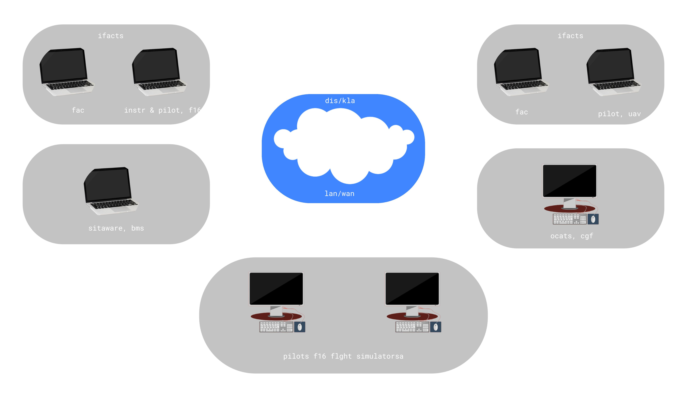

<h1>roadmap back end developer</h1>

<h2>internet</h2>

1. bagaimana internet bekerja

2. apa itu http

3. apa itu browser dan cara bekerjanya

4. apa itu dns dan cara bekerjanya

5. apa itu domain nama

6. apa itu hosting

<h2>tahu dasar front end</h2>

1. HTML

<ol>
    <li>belajar html di w3school</li>
    <li>belajar dasar html 50 menit perhari dilakukan sampai 5 hari </li>
</ol>

2. CSS

<ol>
    <li>belajar html di w3school</li>
    <li>belajar dasar css 50 menit perhari dilakukan sampai 5 hari </li>
</ol>

3. JS

<ol>
    <li>belajar html di w3school</li>
    <li>belajar dasar javascript 50 menit dilakukan sampai 5 hari </li>
</ol>
    
<h2>belajar tentang os dan general knowledge</h2>

A. penggunaan terminal

B. bagaimana sistem operasi secara umum

C. proses pengolahan

D. utas dan konkurensi

E. perintah dasar terminal

<h3> general and knowledge of operating system</h3>

operating system adalah sistem software yang mengatur hardware computer dan sumber yang menyediakan pelayanan pada program komputer. operating system digunakan untuk mengeksekusi program user dan memudahkan penyelesaian permasalahan user. selaian itu dengan adanya operating system membuat system nyaman digunakan. operating system mempunyai tujuan untuk menggunakan perangkat keras komouter secara efesien.

generasi pertama os dimulai pada tahun 1945 sampai 1955, generasi ini merupakan awal pengembangan system komputasi elektronik, mengganti gagasan-gagasan mesin komputasi mekanis, generasi kedua os dimulai pada tahun 1955 sampai 1965 yang merupakan sebuah batch processing system yang cara kerjanya yaitu dengan mengumpulkan tugas tugas dalam satu rangkaian kemudian di eksekusi secara berurutan, pada generasi ini komputer komputer belum dilengkapi dengan operating system. generasi ketiga os dimulai pada tahun 1965 sampai 1980, disini operating system dikembangkan untuk melayani banyak pemakai interaktif sekaligus. generasi keemapat os dimulai pada tahun 1980 sampai 2000, pada generasi ini system operasi tidak lagi hanya diperurutkan untuk satu mode pengolahan, tetapi telah ditujukan untuk banyak mode pengolahan, misalnya mendukung batch processing, timesharing, networking dan (soft) realtime application sekaligus

